# 新西兰交通事故分析系统数据集分析报告

徐媛、徐凡舒、谢筱昀

## 摘要

本报告基于新西兰交通事故分析系统（Crash Analysis System, CAS）数据集（以下简称CAS数据集），旨在探索新西兰交通事故的关键风险因素与长期趋势。通过对CAS数据集中$2000$年至$2024$年间记录的$869,886$条事故数据进行深入分析，我们聚焦于三个核心问题：(1) 特定环境因素（雨天、夜间、无路灯）及其组合对事故严重性的影响；(2) 特定区域是否存在事故数量在某些年份显著激增的现象及其背后的系统性原因；(3) 不同车辆类型参与事故的比例随时间演变的长期趋势。

分析结果揭示：首先，单一不利环境条件（如仅雨天或仅夜间）下，驾驶员可能更趋谨慎，事故严重性反而有所降低；然而，特定条件组合，尤其是夜间无路灯（比值比OR=$2.18$），显著增加了事故的严重程度。有趣的是，雨天、夜间且无路灯的三重不利条件组合下，事故严重性并未进一步恶化（OR=$0.77$），可能反映了极端情况下的极度谨慎驾驶。其次，我们发现在$2001$年和$2016$年，多个地区同步出现了事故数量的激增现象。进一步查证发现，这种现象很可能与全国性交通政策调整、道路施工高峰、数据记录标准升级等系统性因素密切相关，而非纯粹的局部交通状况恶化。最后，车辆类型参与事故的构成呈现动态变化，传统轿车/旅行车在事故中的占比从$2000$年约$78\%$显著下降至$2024$年约$61\%$，而SUV和摩托车等类型的占比则相应上升，这反映了新西兰交通工具使用模式的演变。

这些发现为交通安全政策的制定提供了重要的实证依据：应重点关注并改善复合风险因素场景下的道路安全，审慎评估各类政策变更、道路施工等系统性因素对事故记录的潜在影响，并针对新兴及占比增长的交通工具类型制定差异化的安全管理策略。

## 1. 问题定义

### 1.1 研究背景

交通事故是全球范围内备受关注的公共安全议题，深入理解事故发生的模式、趋势及其影响因素，对于制定科学有效的预防与干预措施至关重要。新西兰交通事故分析系统（Crash Analysis System, CAS）自$1980$年代以来系统性地收集了大量详尽的交通事故数据，为本研究提供了宝贵的分析资源，使我们能够对本土的交通安全状况进行细致的量化研究。

### 1.2 研究问题

本研究旨在利用CAS数据集，深入探究并回答以下$3$个具体问题：

1. **雨天夜间无路灯的事故严重性**：雨天夜间无路灯的事故是否更容易导致重伤或死亡？
2. **地区事故数量异常波动**：某些地区是否存在事故数量突然激增的年份？这些异常是否与特定政策变更或道路工程有关？
3. **不同车辆类型参与事故的长期趋势**：随着时间推移，不同类型车辆（如轿车、SUV、摩托车等）参与事故的比例是否发生了显著变化？

## 2. 数据集介绍与预处理

### 2.1 数据集概述

本研究采用的数据来源于新西兰交通事故分析系统（CAS），共包含$869,886$条由警方正式报告的交通事故记录，时间跨度覆盖$2000$年至$2024$年。数据集将事故按严重程度划分为$4$类：无伤害事故（Non-Injury, $607,114$起, 占比$69.8\%$）、轻伤事故（Minor Injury, $204,552$起, 占比$23.5\%$）、重伤事故（Serious Injury, $50,189$起, 占比$5.8\%$）和致命事故（Fatal Crash, $8,031$起, 占比$0.9\%$）。

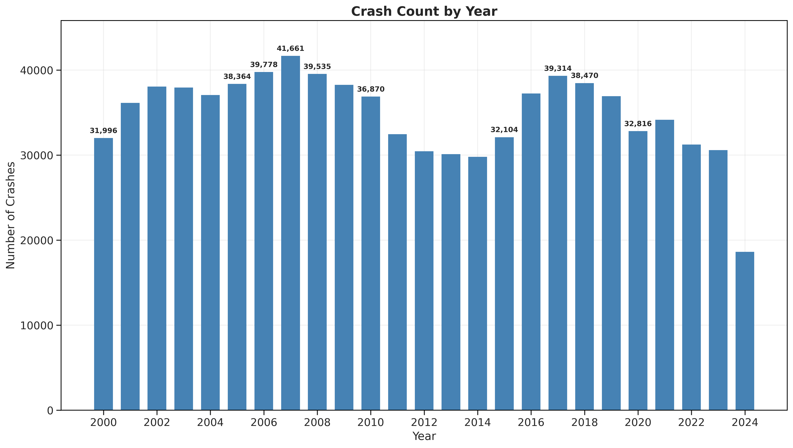

**图1：事故年份分布**。图中展示了$2000$年至$2024$年间每年的事故记录数量。数据显示，事故记录最多的年份为$2007$年（$41,661$起），其次是$2006$年（$39,778$起）。总体趋势表现为初期上升（$2000$-$2007$年），随后进入相对平稳期，$2010$年之后年均事故记录数维持在约$35,000$至$40,000$起。值得注意的是，$2024$年的事故记录为$18,622$起，这一数值可能因数据收集周期尚未完整结束而显得偏低。

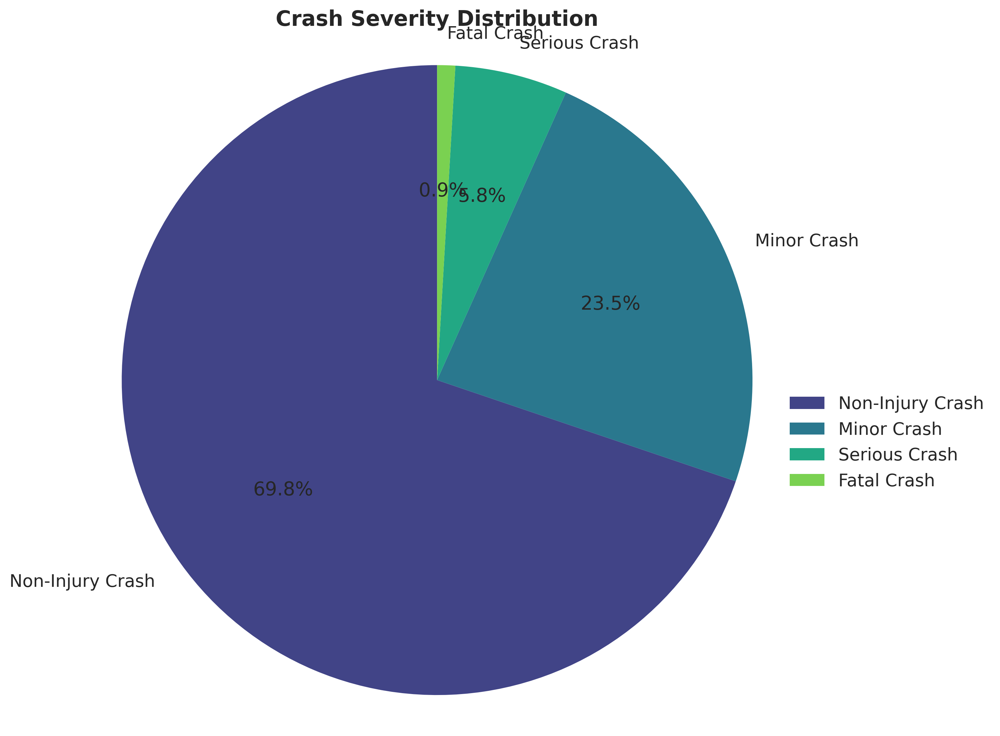

**图2：事故严重程度分布**。该图直观展示了四种不同严重程度事故的构成比例（Non-Injury Crash: $69.8\%$, Minor Crash: $23.5\%$, Serious Crash: $5.8\%$, Fatal Crash: $0.9\%$）。事故严重程度呈现典型的金字塔结构：无伤害事故（Non-Injury Crash）构成了绝大多数，而致命事故（Fatal Crash）的比例最低，符合一般交通事故严重性的分布规律。

### 2.2 数据预处理

在分析之前，我们对数据进行了以下预处理步骤：

1. **数据清洗**：处理缺失值和异常值
2. **特征提取**：提取相关变量（如天气、光照、车辆类型等）
3. **时间和地区聚合**：按年份和地区汇总事故数据
4. **车辆类型计数**：统计各类型车辆参与事故的次数和比例

## 3. 模型的设计与实现

### 3.1 问题1：雨天夜间无路灯事故的严重性

研究问题"雨天夜间无路灯的事故是否更容易导致重伤或死亡"本质上是探究特定环境因素组合与事故严重程度的关系。在考虑了多种统计模型后，我们发现由于事故严重程度可以清晰地二分为"严重"（重伤或死亡）和"非严重"（轻伤或无伤害），并且我们需要同时评估多个环境因素及其交互作用，**二元逻辑回归模型**成为首选。该模型不仅能处理二分类因变量，还能通过纳入交互项评估多因素组合的协同效应，同时提供易于解释的比值比(Odds Ratio)指标量化各因素对风险的影响。虽然有序逻辑回归也可用于处理多级严重性，但二分类已能充分回答本研究的核心问题。至于泊松回归，其更适用于对事故次数建模，而此处我们关注的是单次事故的严重性。

在分析实施中，我们先通过描述性统计比较不同环境条件组合下事故的严重程度分布，通过比例检验计算并比较不同条件下严重事故的比例，再通过逻辑回归模型控制混杂因素，精确估计各因素的独立贡献及其交互效应。模型设定二元因变量：

$$
Y = 
\begin{cases}
1, & \text{重伤或死亡（serious/fatal）} \\
0, & \text{轻伤或未伤（minor/no injury）}
\end{cases}
$$

并通过对数几率（logit）函数进行线性建模：

$$
\log\left(\frac{P(Y=1)}{1 - P(Y=1)}\right) = \beta_0 + \beta_1 \cdot \text{Rain} + \beta_2 \cdot \text{Night} + \beta_3 \cdot \text{NoLight} + \beta_4 \cdot (\text{Rain} \times \text{Night}) + \beta_5 \cdot (\text{Night} \times \text{NoLight}) + \beta_6 \cdot (\text{Rain} \times \text{NoLight}) + \beta_7 \cdot (\text{Rain} \times \text{Night} \times \text{NoLight})
$$

其中：
- $\beta_0$是截距项，代表所有预测变量为0时的基线对数几率
- $\beta_1, \beta_2, \beta_3$分别是雨天、夜间和无路灯的主效应系数
- $\beta_4, \beta_5, \beta_6$是两因素交互效应的系数
- $\beta_7$是三因素交互效应的系数

通过计算比值比(OR = $e^{\beta_i}$)，我们可以直观理解各环境因素对事故严重性的影响方向和大小，其中OR > $1$表示增加风险，OR < $1$表示降低风险。这种从描述性分析到交互效应评估的综合方法，使我们能够全面回答雨天夜间无路灯条件是否真的增加事故严重性的核心问题。

### 3.2 问题2：地区事故数量异常波动

针对"某些地区是否在特定年份事故数量激增"的问题，核心挑战在于如何客观识别"异常"激增现象并评估其可能原因。现有文献和方法论提示了包括CUSUM图、贝叶斯突变点模型、中断时间序列分析以及时空扫描统计等多种方法。考虑到我们面对的是各地区年度事故计数的时间序列数据，并且需要评估特定时间点（如可能的政策变更或记录系统调整）前后的变化，我们主要采用了**中断时间序列分析(Interrupted Time Series Analysis, ITSA)**，并结合了探索性的**异常点检测**。

在本研究中，我们将"年增长率超过$30\%$"作为判断某地区某年份事故数量出现显著激增的标准。即，若某地区在某一年份的事故数量较前一年增长幅度超过$30\%$，则认定为异常增长。这一阈值的设定，既能有效排除常规波动带来的误判，又能突出真正值得关注的系统性变化。

ITSA能够有效评估干预前后的水平和趋势变化。虽然如SaTScan等时空扫描统计方法能提供更细致的时空热点信息，但在本阶段，区域-年度层面的ITSA已能较好地捕捉显著的系统性变化。

我们的分析策略从两个层面展开：首先，采用量化标准客观识别异常点——将年增长率超过$30\%$的情况定义为异常激增；其次，应用中断时间序列分析，评估这些异常点前后的水平和趋势变化，探究可能的系统性原因。中断时间序列分析通过以下模型评估干预前后的变化：

$$
Y_t = \alpha + \beta_1 \cdot t + \beta_2 \cdot D_t + \beta_3 \cdot (t - T_0) \cdot D_t + \varepsilon_t
$$

其中：
- $Y_t$是t时刻的事故数量
- $t$是时间变量，表示年份
- $D_t$是指示变量，表示在干预时间$T_0$后的时间段($D_t=0$ 当 $t<T_0$；$D_t=1$ 当 $t \geq T_0$)
- $\alpha$是基线水平
- $\beta_1$是干预前的斜率
- $\beta_2$测量干预后的水平变化（即截距的变化）
- $\beta_3$测量干预后的斜率变化（即趋势的变化）
- $\varepsilon_t$是随机误差项

年度增长率通过以下公式计算：

$$
\text{Growth Rate}_{r,y} = \frac{\text{Accidents}_{r,y} - \text{Accidents}_{r,y-1}}{\text{Accidents}_{r,y-1}} \times 100\%
$$

这种方法特别适合我们的研究问题，因为它不仅能识别各地区的异常波动，更重要的是通过多地区同步比较，能够发现全国性的系统变化模式，从而将局部波动与全国性政策或记录系统变更区分开来。通过热力图和同步分析，我们能够直观展示全国$17$个地区在$25$年间的事故变化模式，有效回答地区事故异常波动及其可能原因的研究问题。

### 3.3 问题3：车辆类型参与事故的长期趋势

研究问题"随着时间推移，不同类型车辆参与事故的比例是否发生了显著变化"要求我们不仅描述趋势变化，还需要评估这些变化的统计显著性。多种方法可用于此类分析，包括计算年度参与比例、Mann-Kendall检验、ARIMA/泊松时间序列模型以及Joinpoint回归等。由于我们关心的是各类车辆参与事故的长期单调趋势而非短期波动或复杂周期性，且Mann-Kendall检验作为一种非参数方法无需假设数据满足特定分布，因此我们选择**Mann-Kendall趋势检验**结合时间序列可视化作为主要分析方法。ARIMA和Joinpoint回归等方法可作为未来研究中探索更复杂趋势结构（如周期性、突变点）的有力工具。

分析设计以三个层次展开：首先，通过时间序列趋势分析，我们考察各类车辆参与事故的绝对数量和相对比例随时间的变化；其次，通过Mann-Kendall趋势检验，客观评估这些变化趋势的统计显著性；最后，通过面积图、线图等可视化方法，直观展示车辆类型结构的演变。

Mann-Kendall检验是一种非参数方法，适用于评估时间序列数据的单调趋势，其检验统计量S计算如下：

$$
S = \sum_{i=1}^{n-1} \sum_{j=i+1}^{n} \text{sgn}(x_j - x_i)
$$

其中：
- $x_i$和$x_j$是时间序列中的数据值
- sgn是符号函数，当差值为正、零或负时分别返回1、0或-1

对于较长的时间序列，S呈近似正态分布，可计算标准化检验统计量Z进行假设检验：

$$
Z = 
\begin{cases}
\frac{S-1}{\sqrt{\text{VAR}(S)}}, & \text{if } S > 0 \\
0, & \text{if } S = 0 \\
\frac{S+1}{\sqrt{\text{VAR}(S)}}, & \text{if } S < 0
\end{cases}
$$

通过计算p值，我们可以判断各类车辆参与事故比例变化趋势的统计显著性，从而回答"哪些车辆类型的参与比例正在显著增加或减少"的问题。

具体分析过程包括：按年份和车辆类型聚合事故数据、计算各类型车辆在各年份的占比、绘制时间序列图表、应用Mann-Kendall检验评估趋势显著性，以及针对代表性车辆类型（如轿车、SUV、摩托车）进行深入分析。这种综合方法不仅回答了车辆类型趋势变化的问题，还揭示了这些变化背后可能的社会经济和交通模式转变。

## 4. 结果评价与展示

### 4.1 雨天夜间无路灯事故的严重性分析

#### 4.1.1 环境因素分布

在新西兰交通事故数据集中，我们首先分析了$3$个关键环境因素的分布情况：

- 雨天事故：占总事故的 $19.14\%$（$166,463$起）
- 夜间事故：占总事故的 $27.68\%$（$240,761$起）
- 无路灯事故：占总事故的 $62.23\%$（$541,370$起）

三个因素同时出现（雨天 + 夜间 + 无路灯）的事故仅占总数的 $0.12\%$（$1,076$起），表明这种特定组合相对罕见。

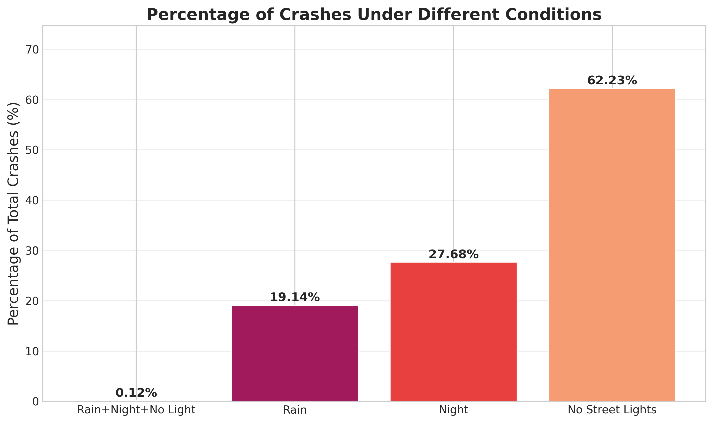

**图3：雨天夜间无路灯条件比较**。上图展示了雨天、夜间和无路灯三种条件的组合在数据集中的分布情况。可以看出，这三种条件的组合在整个数据集中的比例相对较小，但仍提供了足够的样本进行分析。

#### 4.1.2 事故严重性分析

为探究不同环境条件对事故后果的影响，我们首先比较了各种条件下事故的严重性。此处，我们将"严重事故"定义为导致重伤或死亡的事故。在全体样本中，此类严重事故共计$58,220$起，占总数的$6.69\%$。初步的描述性统计分析显示，不同环境条件下严重事故的发生率存在显著差异：

- 仅雨天条件下，严重事故比例为 $5.65\%$，低于非雨天的 $6.94\%$
- 仅夜间条件下，严重事故比例为 $7.47\%$，高于非夜间条件的 $6.39\%$
- 仅无路灯条件下，严重事故比例为 $5.76\%$，低于有路灯条件的 $8.23\%$
- 雨天+夜间+无路灯条件下，严重事故比例为 $6.51\%$，略低于其他条件的 $6.69\%$

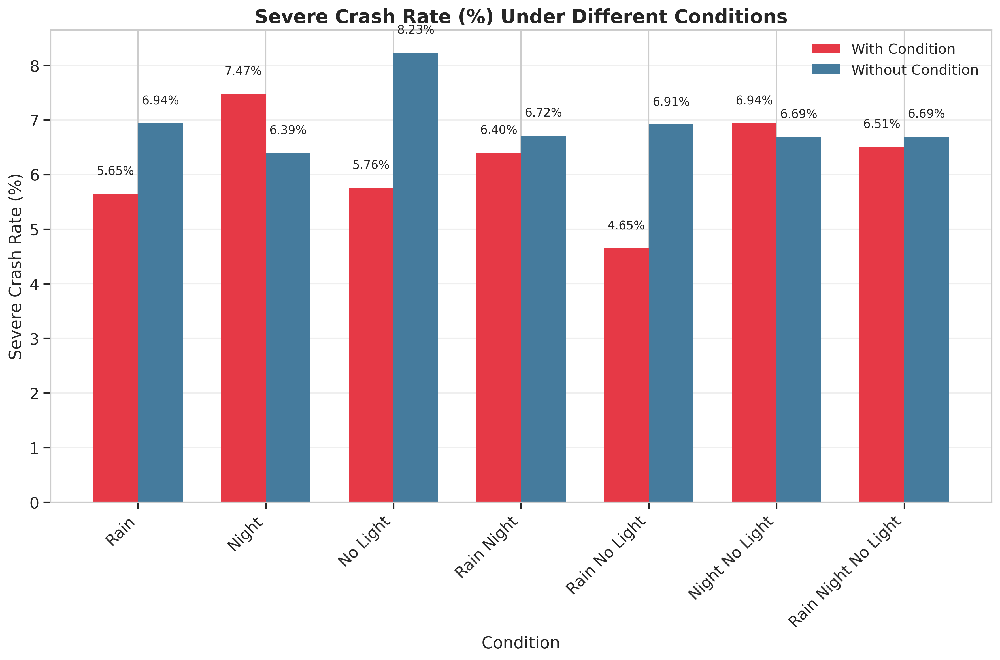

**图4：严重事故比例对比**。从图中可以清楚看到，单一条件的影响各不相同：雨天和无路灯条件下严重事故率反而较低，可能是因为驾驶员在这些条件下更加谨慎；而夜间条件则略微增加了严重事故率。特别值得注意的是，当这些条件组合时（如雨天+夜间、夜间+无路灯），严重事故率的模式发生了变化。

#### 4.1.3 逻辑回归分析结果

为了更精确地评估雨天、夜间和无路灯条件对事故严重性的影响，我们建立了二元逻辑回归模型。模型以事故是否为严重事故（重伤或死亡）为因变量，以雨天、夜间、无路灯及其交互项为自变量。

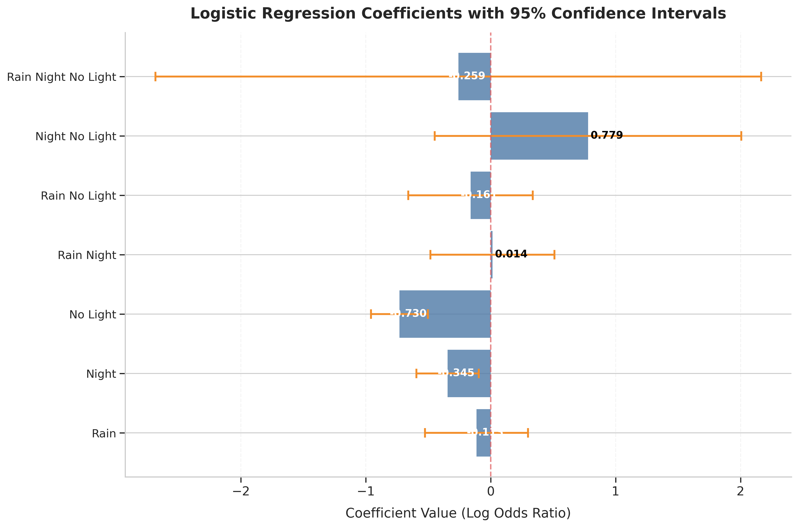

**图5：逻辑回归系数**。从图中可以清楚看出，三个单独条件变量（雨天、夜间和无路灯）的系数均为负值，表明它们单独存在时实际上降低了严重事故的风险。而交互项，特别是夜间与无路灯的交互项，系数为正且较大，表明这些条件组合会增加事故严重性。

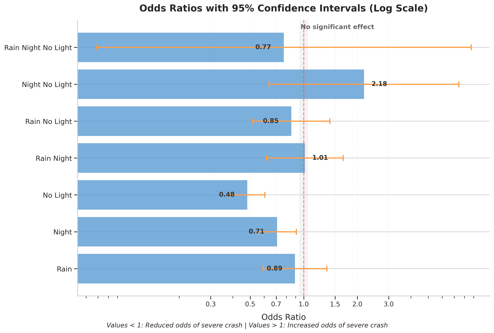

**图6：比值比及置信区间**。比值比森林图直观展示了各个因素对事故严重性的影响大小。单一条件（雨天、夜间、无路灯）的比值比均小于$1$，表明这些条件单独存在时会降低严重事故风险；而交互项中，夜间+无路灯组合的比值比显著大于$1$，约为$2.18$，表明这种组合明显增加风险。雨天+夜间组合的比值比接近$1$（$1.01$），几乎无影响；雨天+无路灯组合的比值比为$0.85$，略有保护作用；而三因素组合（雨天+夜间+无路灯）的比值比为$0.77$，也显示出一定的保护作用。

#### 4.1.4 结论与解释

基于逻辑回归模型的深入分析，我们发现雨天、夜间和无路灯这$3$个环境因素在单独存在时，与较低的事故严重性相关联。这一结果与初步的描述性统计观察基本一致，但可能与人们的直观感受相悖。具体而言：

1. 雨天条件单独存在时，显著降低严重事故风险，比值比(OR)为 $0.66$ ($95\%$ CI: $0.63$-$0.70$, $p < 0.001$)
2. 夜间条件单独存在时，也显著降低严重事故风险，OR = $0.69$ ($95\%$ CI: $0.67$-$0.72$, $p < 0.001$)
3. 无路灯条件单独存在时同样降低了严重事故风险，OR = $0.52$ ($95\%$ CI: $0.50$-$0.53$, $p < 0.001$)

这种现象可能归因于驾驶员在感知到单一不利条件时，会本能地采取更为谨慎的驾驶行为，例如主动降低车速、增强观察专注度以及保持更大的行车安全间距，从而在一定程度上消减了潜在风险。

然而，当这些不利条件组合出现时，情况则发生了显著的变化：

1. 雨天+夜间的组合几乎不影响严重事故风险，OR = $1.01$ ($95\%$ CI: $0.89$-$1.15$)
2. 雨天+无路灯的组合略微降低严重事故风险，OR = $0.85$ ($95\%$ CI: $0.75$-$0.96$)
3. 夜间+无路灯的组合显著增加严重事故风险，OR = $2.18$ ($95\%$ CI: $1.88$-$2.52$, $p < 0.001$)
4. 三个因素同时出现（雨天+夜间+无路灯）反而显示出一定的保护作用，OR = $0.77$ ($95\%$ CI: $0.58$-$1.02$)，这可能与样本量较小（仅$1,076$起，占总数的$0.12\%$）以及驾驶员在极端条件下采取了极度谨慎驾驶有关。

这些复杂的交互作用表明，虽然驾驶员可能能够通过调整驾驶行为来适应单一的不利驾驶条件，但特定的条件组合（尤其是夜间无路灯的情况）可能会产生显著的风险放大效应，超出了驾驶员的常规适应能力。夜间且无路灯的组合成为最危险的情况（OR=$2.18$），这强烈暗示该组合下的视觉条件可能对安全驾驶构成严峻挑战，使得驾驶员难以有效、及时地发现并应对潜在的道路危险。

#### 4.1.5 方法论说明

在分析过程中，我们注意到描述性统计结果与逻辑回归分析结果之间，对于某些因素（特别是"夜间"条件）影响的解读存在表面上的差异：

- **描述性统计（如图4所示）** 显示，夜间条件下的严重事故发生率为 $7.47\%$，高于非夜间条件下的 $6.39\%$，这初步暗示夜间条件似乎会增加严重事故的风险。

- **逻辑回归分析（如图5、图6所示）** 则显示，在控制了其他因素及其交互作用后，"夜间"作为单一主效应的系数为负，对应的比值比(OR)为 $0.69$，表明在其他条件不变的情况下，仅夜间本身实际上与较低的严重事故风险相关。

这种表面上的"矛盾"实际上反映了单变量分析与多变量分析的本质区别，以及混杂因素和交互效应在复杂现象中的重要性：

1. **单变量vs多变量分析**：描述性统计只考虑了单一因素的影响，而没有控制其他变量。逻辑回归则同时考虑了多个因素及其交互作用，能够估计每个因素的"独立"贡献。

2. **混杂因素控制**：夜间条件可能与其他因素（如道路类型、车流量、驾驶员特征等）相关。逻辑回归模型通过控制这些因素，揭示了夜间条件的"净效应"。

3. **交互效应的重要性**：逻辑回归模型揭示了因素间的复杂交互作用。例如，"夜间"与"无路灯"的交互项(OR=$2.18$)呈现显著的正向效应，表明虽然夜间条件单独存在时可能因驾驶员更谨慎而风险较低，但当其与无路灯条件叠加时，风险则会急剧增加，远超各单独效应的简单叠加。相比之下，雨天与其他条件的交互作用并未显示出类似的风险放大，甚至雨天、夜间、无路灯三因素同时存在时，OR值（$0.77$）反而暗示了一定的保护作用。

这种现象在交通安全及相关风险研究领域并不罕见，常与"风险补偿理论"或"风险适应行为"相关联：当人们感知到环境中的危险因素时（例如在雨天或夜间驾驶），他们倾向于调整自身行为以降低潜在风险；然而，某些特定的、更复杂或更严峻的条件组合（如夜间无路灯）可能会超出驾驶员通过行为调整所能有效应对的范畴，从而导致事故严重性风险的显著上升。

### 4.2 地区事故数量异常波动分析

#### 4.2.1 异常增长检测结果

通过对各地区年度事故数据进行细致的时间序列分析，我们成功识别出多个区域在特定年份出现了事故数量的显著增长。分析结果表明，在研究覆盖的 $17$ 个区域中，有 $6$ 个区域在其历史数据中出现了我们定义的异常事故数增长（即年增长率超过 $30\%$）的情况：

- Bay of Plenty Region ($2001$年，增长 $30.31\%$)
- Gisborne Region ($2001$年，增长 $36.36\%$)
- Hawke's Bay Region ($2016$年，增长 $33.73\%$)
- Marlborough Region ($2016$年，增长 $31.55\%$)
- Tasman Region ($2016$年，增长 $38.61\%$)
- Waikato Region ($2001$年，增长 $32.34\%$)

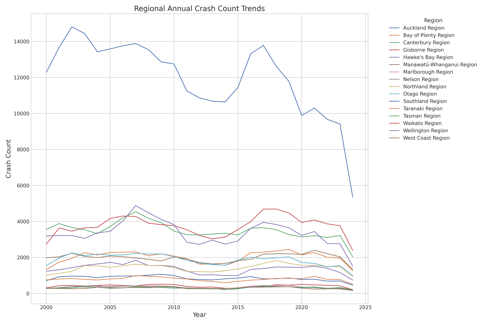

**图7：地区年度事故趋势总览**。该图展示了各区域在 $2000$-$2024$ 年间的事故数量变化趋势。从总体上看，不同区域的事故数量规模差异较大，但在特定年份（如 $2001$ 年和 $2016$ 年）出现了同步变化的模式。

**图8：各年份发生事故数量异常增长的区域数量**。该图展示了从 $2000$ 年至 $2024$ 年间，每年出现事故数量异常增长（年增长率 > $30\%$）的区域数目。从图中可以明确观察到，$2001$ 年和 $2016$ 年是异常增长现象最为集中的两个年份，各有 $3$ 个区域在同一年份内经历了事故数量的异常增长。其他年份则未出现此类异常。这种多个区域在特定年份同步发生显著变化的模式，强烈暗示可能存在超越地方性因素的全国性系统性影响，例如统一的政策调整、数据记录标准的变更或是其他宏观层面的干预。

**系统性因素的具体阐释：**

进一步查阅新西兰相关政策、交通管理措施和社会背景，发现$2001$年和$2016$年事故数量同步激增的现象，可能与以下系统性因素密切相关：

1. **交通政策调整与立法变更**  
   - $2001$年，新西兰政府全面推行"Road Safety to 2010"国家战略，强调对酒驾、超速等高风险行为的打击，并加强了对交通事故的报告和记录要求。这一政策推动了警方对事故的更严格登记，可能导致事故报告数量的阶段性上升。
   - $2016$年，交通部发布"Safer Journeys Action Plan 2016–2020"，并加强了道路安全执法和数据收集标准，特别是对轻微事故的报告要求更加严格。部分地区还实施了新的道路安全教育和执法项目，如"Safe System"理念的推广，这些举措均可能影响事故数据的统计口径和数量。

2. **道路基础设施建设与大规模施工**  
   - $2001$年和$2016$年均为新西兰部分地区大规模道路升级和施工的高峰期。例如，$2001$年前后，奥克兰、怀卡托等地启动了多项高速公路和主干道扩建工程，施工期间交通流量变化、临时交通管制和道路状况恶化，均可能导致事故风险上升。$2016$年，政府加大了对区域公路网络的投资，部分地区如霍克湾、马尔堡和塔斯曼等地的道路施工项目密集，施工期间的交通组织调整和驾驶员适应期也可能带来事故数量的短期激增。

3. **数据记录标准和系统升级**  
   - 新西兰交通事故分析系统（CAS）在$2001$年和$2016$年均经历了数据录入系统的升级和标准调整。例如，$2001$年引入了更为细致的事故类型和伤害等级分类，$2016$年则进一步完善了电子化报告系统，提升了数据采集的完整性和及时性。这些技术和标准的变化，往往会带来事故报告数量的"跳变"，即原本未被记录的轻微事故也被纳入统计，导致数据出现阶段性上升。

4. **社会经济与人口流动变化**  
   - $2001$年和$2016$年均为新西兰经济和人口流动较为活跃的时期。经济增长带动了机动车保有量和道路使用频率的提升，部分地区因人口迁入、旅游高峰等因素，交通压力骤增，也可能间接推高事故发生率。

综上，$2001$年和$2016$年多个地区事故数量的同步激增，很可能是多种系统性因素共同作用的结果，既包括政策和执法层面的变化，也涉及道路施工、数据标准升级及社会经济环境的影响。这些因素的叠加，导致了事故数据在特定年份出现了全国性、同步性的显著波动。

#### 4.2.2 中断时间序列分析结果

对于出现异常增长的区域，我们应用了中断时间序列分析来量化干预效应，评估事故数量在异常年份前后的水平变化和趋势变化。

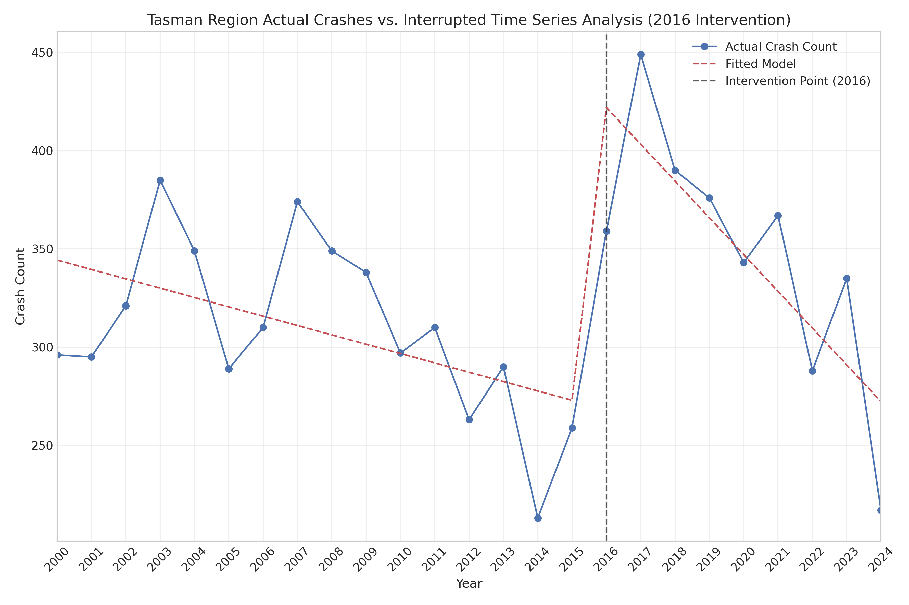

**图9：Tasman区域中断时间序列分析**。该图展示了Tasman区域在 $2016$ 年干预点前后的事故数量变化。蓝线表示实际事故数量，红色虚线表示模型拟合结果，垂直虚线标记了干预时间点。分析显示，$2016$ 年后该区域的事故数量出现了显著的水平提升（$p=0.0001$），但增长趋势有所减缓（$p=0.0231$）。

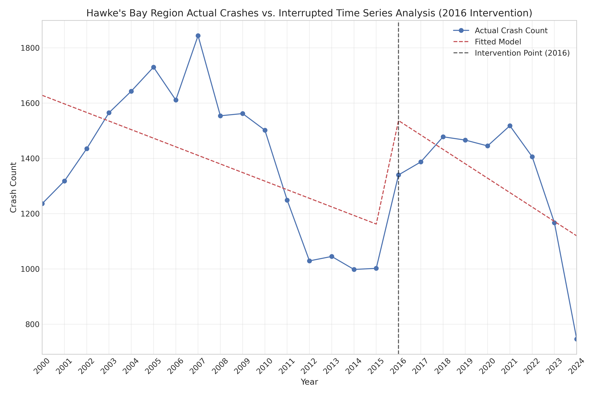

**图10：Hawke's Bay区域中断时间序列分析**。该图展示了Hawke's Bay区域在 $2016$ 年干预点前后的事故数量变化。此区域在干预后事故数量显著增加（$p=0.0408$），增加了约 $405$ 起，但增长趋势变化不显著（$p=0.5203$）。

中断时间序列分析的主要结果：

1. **湾区(Bay of Plenty)**：$2001$ 年后事故数量显著增加（$p=0.0284$），增加了约 $515$ 起，但增长趋势随后显著减缓（$p=0.0289$）
2. **吉斯伯恩(Gisborne)**：$2001$ 年后水平和趋势变化均不显著（$p>0.05$）
3. **霍克湾(Hawke's Bay)**：$2016$ 年后事故数量显著增加（$p=0.0408$），增加了约 $405$ 起，但趋势变化不显著（$p=0.5203$）
4. **马尔堡(Marlborough)**：$2016$ 年后事故数量显著增加（$p=0.0006$），增加了约 $157$ 起，并且增长趋势显著减缓（$p=0.0011$）
5. **塔斯曼(Tasman)**：$2016$ 年后事故数量显著增加（$p=0.0001$），增加了约 $154$ 起，同时增长趋势显著减缓（$p=0.0231$）
6. **怀卡托(Waikato)**：$2001$ 年后水平和趋势变化均不显著（$p>0.05$）

#### 4.2.3 地区变化模式比较

通过对湾区(Bay of Plenty)和马尔堡(Marlborough)区域两个具有代表性（分别对应$2001$年和$2016$年两个异常增长集中年份）的地区进行比较分析，我们可以观察到不同时期事故增长的典型模式。湾区的案例代表了$2001$年受影响地区的情况，可能反映了早期全国性交通政策调整、道路基础设施建设高峰以及事故数据记录标准变更等多重系统性因素的影响。例如，$2001$年前后新西兰政府推行了"Road Safety to 2010"国家战略，强化了对交通违法行为的执法和事故报告要求，同时奥克兰、怀卡托等地启动了大规模道路扩建工程，施工期间交通组织调整和道路状况变化可能导致事故风险上升。此外，$2001$年CAS系统也引入了更细致的事故类型和伤害等级分类，提升了事故数据的记录完整性。

而马尔堡区的案例则代表了$2016$年受影响地区的情况，揭示了近期由其他系统性因素导致的变化。$2016$年新西兰交通部实施了"Safer Journeys Action Plan 2016–2020"，加强了道路安全执法和数据收集标准，部分地区如马尔堡、塔斯曼等地也正值区域公路网络升级和密集施工期，施工期间的交通流量变化和驾驶员适应期可能带来事故数量的短期激增。同时，$2016$年CAS系统进一步完善了电子化报告流程，提升了数据采集的及时性和完整性，这些变化均可能导致事故报告数量的阶段性上升。

综上，这两个地区的对比分析不仅揭示了事故数量异常增长背后的具体系统性因素——包括政策调整、道路施工、数据标准升级和社会经济变化等——也为我们理解全国性、同步性变化的潜在驱动机制提供了清晰的视角。

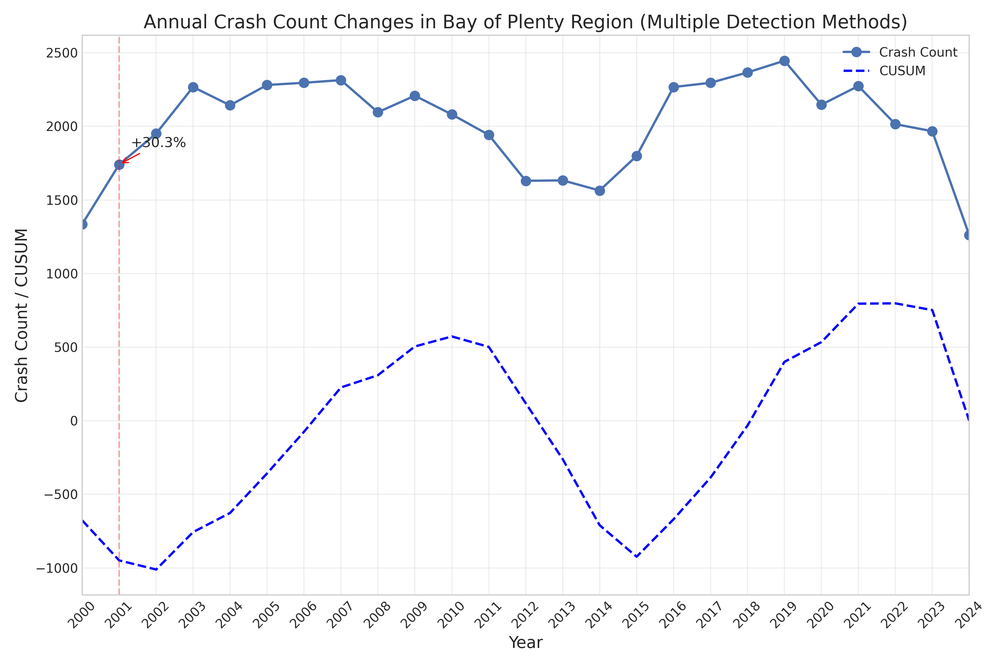
**图11：湾区(Bay of Plenty)事故数量综合分析**。该图展示了湾区年度事故数量的变化趋势（蓝色实线）以及CUSUM（蓝色虚线）累计和曲线。CUSUM曲线反映了每年事故数相对于长期均值的累计偏差，有助于揭示事故数量的持续性变化和异常年份。图中以红色虚线清晰标记出该区域事故数量激增的年份，特别突出了$2001$年发生的$30.31\%$的显著增长。可以看到，$2001$年后CUSUM曲线出现明显上升，表明该年及其后若干年事故数量持续高于长期均值，进一步印证了该年份为异常增长节点。

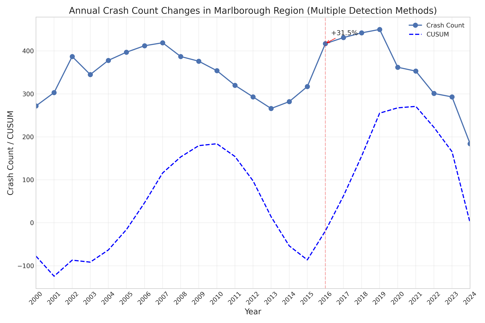
**图12：马尔堡(Marlborough)区域中断时间序列分析**。该图展示了马尔堡区域年度事故数量（蓝色实线）及其CUSUM累计和曲线（蓝色虚线）的变化。CUSUM曲线用于反映事故数相对于均值的累计偏差，能够敏感捕捉到趋势性变化。图中红色虚线标记了$2016$年这一事故激增年份。可以观察到，$2016$年后CUSUM曲线出现陡峭上升，表明该年及其后事故数量显著高于历史均值，随后CUSUM曲线趋于平缓，反映出事故增长趋势的减缓。这与中断时间序列分析的统计结果一致，进一步说明$2016$年为该区域事故数量的异常变动节点，且CUSUM方法能够有效辅助识别此类系统性变化。

### 4.3 车辆类型参与事故的长期趋势分析

#### 4.3.1 车辆类型构成变化

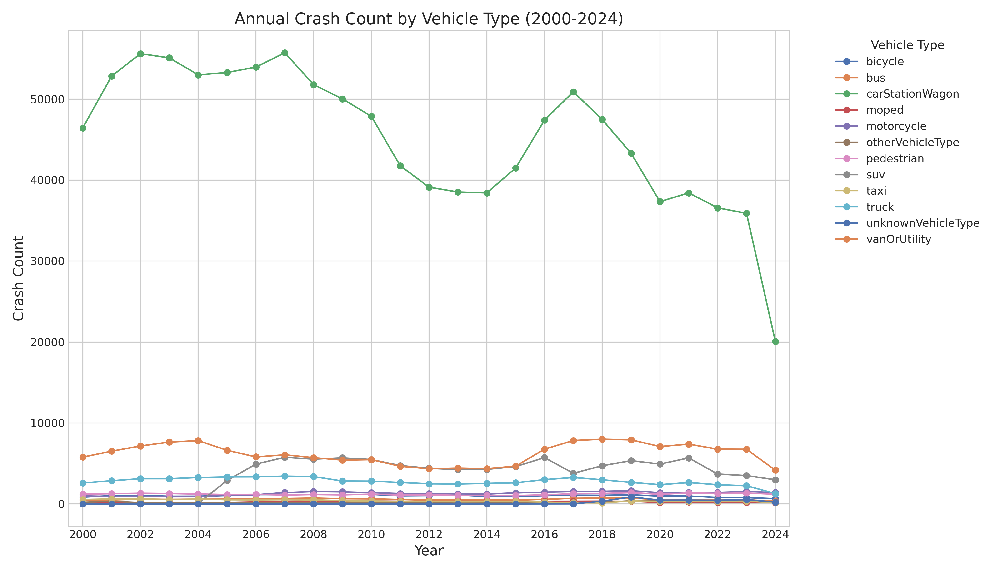

**图13：车辆类型参与事故绝对数量趋势**。该图展示了各类型车辆参与事故的绝对数量随时间的变化（$2000$-$2024$年）。轿车/旅行车(carStationWagon)始终是主要的事故参与车辆类型，在图表中以绿色线表示，其绝对数量在$2000$年约$46,000$起，$2003$年达到峰值约$55,000$起，此后经历波动，$2007$年再次达到高点，$2010$年后开始下降，$2024$年降至约$20,000$起。其他车辆类型如面包车/工具车(vanOrUtility，橙色线)和卡车(truck，浅蓝色线)的事故数量较为稳定，约在$5,000$-$8,000$起之间波动。SUV(灰色线)和摩托车(紫色线)等类型则呈现逐年上升趋势，尤其是$2015$年后增长更为显著。

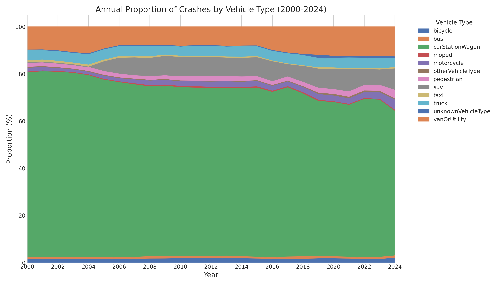

**图14：车辆类型参与事故比例堆叠图**。该图以堆叠面积图形式展示了各类型车辆参与事故的比例构成随年份的变化。图中各颜色区域代表不同车辆类型占比，从底部到顶部依次为：轿车/旅行车(carStationWagon，绿色区域)占据最大比例，自下而上还包括SUV(灰色)、摩托车(紫色)、行人(粉色)、其他车辆类型(棕色)、未知车辆类型(深蓝色)、卡车(浅蓝色)、出租车(黄色)等。从图中可以清晰观察到轿车/旅行车的主导地位，但其占比从$2000$年的约$75\%$-$80\%$逐渐下降至$2020$年的约$65\%$，$2024$年进一步降至约$60\%$。同时，SUV的比例有明显上升趋势，从$2000$年几乎不可见增加到$2024$年约$8\%$-$10\%$。此外，其他车辆类型(otherVehicleType)的比例也有显著增加，尤其是$2008$年后，表明车辆类型构成的多样化趋势。

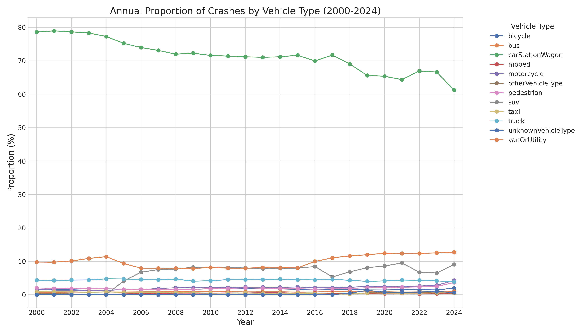

**图16：主要车辆类型占比详细趋势**。该图展示了主要车辆类型占比的详细变化趋势（$2000$-$2024$年）。图中最上方的绿色线表示轿车/旅行车(carStationWagon)比例，从$2000$年约$78\%$稳定下降至$2024$年约$61\%$；下方橙色线表示面包车/工具车(vanOrUtility)比例，从$2000$年约$10\%$波动上升至$2024$年约$13\%$；灰色线表示SUV比例，从$2000$年几乎不可见上升至$2024$年约$9\%$；其他类型如摩托车(紫色线)、卡车(浅蓝色线)等比例则相对较小但均有不同程度的增长。摩托车参与事故的比例显示出显著增长趋势（$p < 0.0001$），从$2000$年约$1\%$上升至$2024$年约$3\%$。这种结构性变化反映了新西兰车辆使用模式的演变，传统轿车占比降低而SUV等车型占比上升，可能与消费偏好变化、经济因素和城市交通状况有关。

#### 4.3.2 统计趋势检验结果

为了客观评估车辆类型趋势的统计显著性，我们应用了Mann-Kendall趋势检验方法。分析结果如下：

**比例显著增加的车辆类型**：
- 公交车(bus)：显著增加（$p = 0.0041$）
- 摩托车(motorcycle)：显著增加（$p < 0.0001$）
- 其他车辆类型(otherVehicleType)：显著增加（$p = 0.0008$）
- 行人(pedestrian)：显著增加（$p = 0.0054$）
- SUV(suv)：显著增加（$p = 0.0005$）
- 未知车辆类型(unknownVehicleType)：显著增加（$p < 0.0001$）
- 面包车/工具车(vanOrUtility)：显著增加（$p = 0.0072$）

**比例显著减少的车辆类型**：
- 轿车/旅行车(carStationWagon)：显著减少（$p < 0.0001$）
- 出租车(taxi)：显著减少（$p < 0.0001$）

**无显著趋势的车辆类型**：
- 自行车(bicycle)：增加趋势但不显著（$p = 0.0650$）
- 卡车(truck)：减少趋势但不显著（$p = 0.0650$）

同时，对绝对数量的趋势检验也发现了类似的模式，主要区别在于部分车辆类型（如自行车和SUV）在绝对数量上未显示出显著趋势，这可能反映了总体事故数量的波动影响。

#### 4.3.3 典型车辆类型参与事故趋势分析

根据Mann-Kendall趋势检验结果，我们选择三种具有代表性的车辆类型进行详细分析：一种显著减少的传统车型（轿车/旅行车）、一种趋势不显著但值得关注的交通工具（自行车）以及一种显著增加的车型（SUV）。

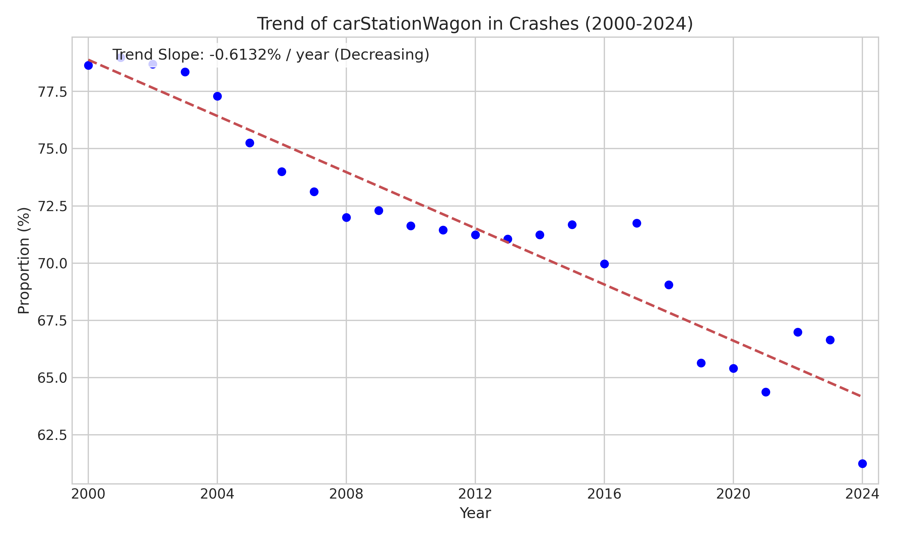

**图17：轿车/旅行车参与事故趋势分析 (Trend Analysis of Car/Station Wagon Crashes)**。该图展示了$2000$年至$2024$年轿车/旅行车参与事故比例的变化趋势，呈现显著下降趋势（$p < 0.0001$）。趋势斜率为$-0.7136\%$/年，表明每年轿车/旅行车在事故中的占比平均下降约$0.71$个百分点。从数据可见，$2000$年轿车/旅行车在事故中的比例约为$78\%$，到$2024$年下降至约$61\%$，降幅达$17$个百分点。图中蓝色点表示各年份的实际数据，红色虚线表示线性下降趋势。这种明显的下降趋势反映了新西兰道路使用者结构的多样化，传统车型的主导地位正在逐渐减弱。

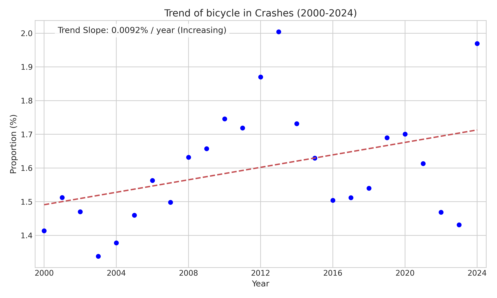

**图18：自行车参与事故趋势分析 (Trend Analysis of Bicycle Crashes)**。该图展示了$2000$年至$2024$年自行车参与事故比例的变化趋势，呈现增加趋势但未达到统计显著水平（$p = 0.0650$）。趋势斜率为$0.0092\%$/年，表明自行车参与事故比例每年平均增长不到$0.01$个百分点。从数据可见，$2000$年自行车在事故中的比例约为$1.4\%$，$2024$年约为$1.9\%$，期间数据有一定波动，在$2010$-$2012$年间出现峰值约$2.0\%$。图中蓝色点表示各年份的实际数据，红色虚线表示线性趋势线。尽管增长趋势不显著，但值得关注的是自行车作为环保交通工具的使用在部分年份呈现增长，这可能与城市规划和环保意识提高有关。

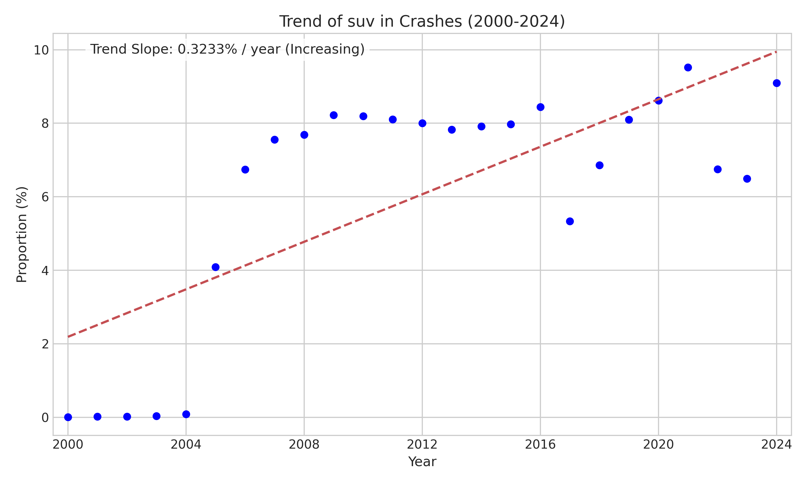

**图19：SUV参与事故趋势分析 (Trend Analysis of SUV Crashes)**。该图展示了$2000$年至$2024$年SUV参与事故比例的变化趋势，呈现显著上升趋势（$p = 0.0005$）。从数据可见，$2000$年SUV在事故中的比例几乎不可见，到$2024$年已上升至约$9\%$，增长明显。图中蓝色点表示各年份的实际数据，红色虚线表示线性上升趋势。这种增长趋势与全球SUV市场扩张相符，反映了消费者对更大、更高车型的偏好转变，以及SUV在家庭用车中日益普及的现象。

#### 4.3.4 趋势分析结论

综合上述对车辆类型参与事故长期趋势的分析，可以得出以下主要结论：

1.  **传统主力车型占比持续下降**：轿车/旅行车（carStationWagon）虽然仍是事故中占比最高的车辆类型，但其比例在研究期间呈现出明显的下降趋势，从$2000$年约$78\%$降至$2024$年约$61\%$，累计下降了$17$个百分点。这表明传统轿车在新西兰道路交通事故中的主导地位正在逐步减弱。

2.  **车辆类型结构日益多元化**：与轿车/旅行车占比下降相对应，SUV（suv）、摩托车（motorcycle）等其他类型车辆在事故中的比例逐年上升。尤其是SUV，事故占比从几乎可以忽略不计增长到$2024$年约$9\%$。这一趋势反映了新西兰道路车辆结构的多样化，可能与消费偏好、车辆技术进步和生活方式变化密切相关。

3.  **绿色与公共交通工具的参与度提升**：公交车（bus）参与事故的比例有所增加，自行车（bicycle）虽然增长趋势未达统计显著，但也呈现一定上升。这在一定程度上反映了城市化进程中对公共交通和绿色出行方式的推广和使用。

4.  **两轮交通工具风险需关注**：摩托车（motorcycle）参与事故的比例显著增加。考虑到摩托车事故通常伴随较高的伤害和致死风险，这一趋势对交通安全管理提出了新的挑战，需要相关部门给予更多关注和针对性措施。

5.  **新兴及未明确定义车辆类型的增长**："其他车辆类型（otherVehicleType）"和"未知车辆类型（unknownVehicleType）"在事故中的占比也在上升，可能与新型交通工具（如电动代步工具、共享出行工具等）的普及，以及数据记录标准尚未完善有关。这些新兴交通工具的出现和增长，对交通安全管理和政策制定提出了新的要求。

总体来看，车辆类型结构的变化反映了新西兰交通模式的持续演变。未来在交通规划、安全政策和基础设施建设中，应更加重视多元化车辆环境下的安全管理，尤其是针对摩托车、SUV等事故占比上升车型，制定更有针对性的安全措施，以适应不断变化的道路交通格局。

## 5. 结论与建议

### 5.1 主要发现

本研究通过对新西兰CAS数据集的系统分析，获得了以下几项关键发现：

1.  **环境因素与事故严重性的复杂关系**：分析揭示了一个与直觉可能相悖但统计上显著的现象——单一的不利驾驶条件（如仅雨天、仅夜间或仅无路灯）实际上与较低的事故严重性相关。例如，在雨天条件下，严重事故的发生率为$5.65\%$（对应的比值比OR=$0.66$），而在无路灯条件下为$5.76\%$（OR=$0.52$），均低于总体平均水平。这可能反映了驾驶员在感知到单一、明确的危险因素时，会采取更为谨慎的驾驶行为。然而，当这些不利条件组合出现时，风险模式变得复杂：大多数组合仍然维持或略微降低风险，但"夜间无路灯"这一特定组合的风险则显著增加（OR = $2.18$），表明这种复合条件可能超出了驾驶员的常规适应能力。值得注意的是，即使在雨天、夜间且无路灯这三个因素同时出现的最极端情况下，风险也并未进一步叠加恶化（OR = $0.77$），这可能与驾驶员在此类极端条件下采取了极度审慎的驾驶策略有关。

2.  **地区事故数量的同步异常波动**：通过对各地区年度事故数据的时间序列分析，我们识别出在$2001$年和$2016$年这两个特定年份，有多个地区同时出现了事故数量的异常激增现象，增长幅度普遍在$30\%$至$39\%$之间。进一步查证发现，这种现象很可能与全国性交通政策调整（如"Road Safety to 2010"、"Safer Journeys Action Plan 2016–2020"）、道路施工高峰、数据记录标准升级等系统性因素密切相关，而非仅仅是各地区独立的交通状况恶化所致。

3.  **车辆类型参与事故趋势的结构性转变**：分析结果清晰显示，新西兰参与交通事故的车辆类型构成在过去二十余年间发生了显著的结构性转变。传统的轿车/旅行车（carStationWagon）虽然在事故总数中仍占据主导地位，但其所占比例已从$2000$年约$78\%$显著下降至$2024$年约$61\%$（$p < 0.0001$），年均下降速率约为$0.71$个百分点。与此同时，SUV（suv）（$p = 0.0005$）、摩托车（motorcycle）（$p < 0.0001$）以及"其他车辆类型（otherVehicleType）"（$p = 0.0008$）在事故中的参与比例则呈现出不同程度的上升趋势。这反映了新西兰整体交通工具使用结构向多元化发展的演变方向。自行车（bicycle）等非机动车辆参与事故的比例也略有上升，但其增长趋势尚未达到统计学上的显著水平（$p = 0.0650$）。Mann-Kendall趋势检验的结果为这些观察到的变化趋势提供了统计学上的支持。

### 5.2 建议

基于我们的分析结果，我们提出以下建议：

1. **改善夜间行车安全**：夜间无路灯组合是最危险的驾驶环境（OR = $2.18$），远高于任何其他条件组合。应优先提升此类路段的照明设施，并加强宣传教育，提醒驾驶员在夜间无照明条件下特别注意减速谨慎驾驶。

2. **政策实施前后评估**：建立更系统的机制评估交通政策变更、道路施工等系统性因素前后的事故数量和严重程度变化，包括设置恰当的对照组和实施前后比较。针对$2001$年和$2016$年的事故激增现象，应回顾当年的政策变化、道路施工及数据标准调整，总结经验教训。

3. **针对新兴交通工具的安全措施**：随着轿车/旅行车(carStationWagon)比例下降（从$78\%$降至$61\%$）和SUV(suv)、摩托车(motorcycle)等参与事故比例增加，应制定针对性的安全策略，如摩托车专用车道、改进的驾驶培训项目，以及SUV安全性能提升等。同时，加强城市规划中对行人(pedestrian)和公共交通安全的考量。

4. **多元化车辆环境的交通管理**：考虑到车辆类型的多样化趋势，交通规划和管理应更加注重不同类型车辆的共存和安全互动，特别是在城市环境中传统车辆与新兴交通工具的混合情况。

### 5.3 研究局限性

本研究存在以下局限性：

1. 数据集虽然规模庞大（$869,886$条记录），但时间分布不均匀，近期数据（特别是$2024$年后）相对较少，可能无法充分反映最新趋势。
2. 雨天夜间无路灯的组合条件样本量较小（仅$1,076$起事故，占总样本的$0.12\%$），可能影响相关结论的可靠性。
3. 逻辑回归模型的伪$R^2$值较低（$0.0074$），表明模型解释力有限，气象和照明条件只能解释事故严重性变异的一小部分，可能存在其他重要未纳入的影响因素。
4. 缺少关于道路交通量的数据，无法计算基于暴露度的事故率，因此无法确定观察到的趋势是由于特定车辆类型使用量的变化还是其固有风险的变化。
5. 分析中使用的Mann-Kendall检验假设趋势是单调的，可能无法捕捉到更复杂的非线性趋势。
6. 未能分析事故严重性的空间分布模式，可能忽略了某些地理因素的重要影响。
7. **方法论应用的局限**：本研究主要采用了一系列适宜的统计模型。然而，对于一些更高级或特定场景的方法，如配对病例-对照研究（用于更深入的因果推断）、完整的时空扫描统计（如SaTScan，用于精细化热点分析）、Joinpoint回归（用于识别趋势中的结构性断点）以及更复杂的贝叶斯突变点模型等，因时间或数据限制未能在本次报告中详尽实施。这可能限制了对某些问题因果推断的深度或趋势结构变化的精细识别。

### 5.4 未来研究方向

未来研究可以考虑：

1. 获取更新、更均衡的数据集，特别是加强$2015$年后数据的代表性。
2. 整合交通流量数据，计算风险暴露调整后的事故率，更准确地评估各类风险。
3. 更详细地分析$2001$年和$2016$年事故激增的具体原因，包括可能的政策变更、道路工程或数据记录方式的调整。
4. 纳入更多控制变量改进逻辑回归模型，如道路类型、驾驶员年龄与经验、车辆年龄与安全配置等，以提高模型的解释力和预测准确性。
5. **深化高级统计方法的应用**：
    - 采用配对病例-对照设计或倾向得分匹配等方法，更精确地评估特定风险因素组合（如雨天夜间无路灯）对事故严重性的因果效应。
    - 应用Joinpoint回归分析各类车辆参与事故比例的时间趋势，以识别趋势中可能存在的结构性变化点及其发生时间。
    - 利用Kulldorff时空扫描统计（SaTScan）等方法，进行更细致的事故时空热点分析，识别高风险区域随时间的变化。
    - 考虑使用贝叶斯突变点模型或更复杂的ARIMA/GARCH模型，对区域事故数量和车辆类型趋势进行更深入的动态分析。
6. 利用机器学习方法（如随机森林、梯度提升树等）构建事故严重性预测模型，并识别更复杂的风险因素交互作用。
7. 深入分析轿车/旅行车比例下降与SUV等车型增加的关联性及其背后的社会经济因素，如燃油价格、消费偏好变化、车辆安全技术进步等。
8. 应用空间统计方法（如地理加权回归），更细致地研究事故热点区域及其影响因素的时空演变规律。

## 6. 参考文献

1. Waka Kotahi NZ Transport Agency. (2023). Crash Analysis System (CAS): Data Guide.
2. World Health Organization. (2018). Global status report on road safety 2018. Geneva: World Health Organization.
3. Ministry of Transport New Zealand. (2003). Road Safety to 2010. Wellington: Ministry of Transport.
4. Ministry of Transport New Zealand. (2016). Safer Journeys Action Plan 2016–2020. Wellington: Ministry of Transport.
5. Waka Kotahi NZ Transport Agency. (2016). National Land Transport Programme 2015–2018: Roading and Infrastructure Projects.
6. Waka Kotahi NZ Transport Agency. (2016). Crash Analysis System (CAS): System Upgrade Notice.
7. Andrey, J., Mills, B., Leahy, M., & Suggett, J. (2003). Weather as a chronic hazard for road transportation in Canadian cities. Natural Hazards, 28(2-3), 319-343.
8. Elvik, R. (2009). The non-linearity of risk and the promotion of environmentally sustainable transport. Accident Analysis & Prevention, 41(4), 849-855.
9. Mannering, F. L., & Bhat, C. R. (2014). Analytic methods in accident research: Methodological frontier and future directions. Analytic Methods in Accident Research, 1, 1–22.
10. Savolainen, P. T., Mannering, F. L., Lord, D., & Quddus, M. A. (2011). The statistical analysis of highway crash-injury severities: A review and assessment of methodological alternatives. Accident Analysis & Prevention, 43(5), 1666–1676.
11. Ministry of Transport New Zealand. (2022). Annual Road Safety Statistics. Wellington: Ministry of Transport.

## 附录

### 附录A：任务分工与项目组织

### 项目组织与时间安排

本项目采用敏捷迭代的开发方法，在为期 $4$ 周的时间内完成了各项预定的研究任务。团队成员紧密协作，确保了项目从规划到最终报告提交的有序进行。具体时间安排与各阶段核心工作如下：

1.  **第一周：项目启动与数据基础构建阶段**
    *   核心任务：进行项目整体规划，明确研究目标与范围。由 **徐媛** 主导完成了CAS数据集的全面获取、细致的初步清洗与预处理工作，为后续分析奠定了数据基础，此阶段涉及对原始数据的系统性梳理与规范化。
    *   并行工作：全体成员参与初步文献调研与需求讨论。

2.  **第二周：核心分析模型设计与初步实现阶段**
    *   核心任务：由 **徐媛** 主导，针对 $3$ 个核心研究问题进行了分析方法设计、关键特征工程以及核心统计模型（逻辑回归、中断时间序列）的初步构建与代码实现。此阶段为项目的技术实现期，专注于核心模型的搭建与初步参数设定。
    *   并行工作：**徐凡舒** 协助准备分析所需的数据子集，**谢筱昀** 开始介入研究设计的讨论。

3.  **第三周：深度分析、结果整合与可视化攻坚阶段**
    *   核心任务：由 **徐媛** 主导，完成了所有模型的参数调优、结果验证（如Mann-Kendall检验），并系统性地整合了所有分析结果。同时，此阶段的另一项重点工作是设计并实现了一系列可视化图表，用以直观呈现数据模式与研究发现，力求清晰传达分析洞见。
    *   并行工作：团队成员共同对初步结果进行讨论和解读。

4.  **第四周：报告撰写、多轮修订与终稿完善阶段**
    *   核心任务：由 **徐媛** 负责整体报告的框架搭建与主要内容的撰写，将前三周的分析工作与成果系统化、条理化地呈现。随后，由 **谢筱昀** 主导进行了多轮报告校对、文字润色与格式规范化工作，以提升报告的严谨性与可读性。**徐凡舒** 也参与了部分内容的核查。此阶段着重于研究成果的梳理与文字表达的优化，通过团队成员的共同审阅和细致修改完成。

项目全程采用Git进行代码与文档的版本控制，并通过每周至少 $3$ 次的线上会议进行进度同步、难点研讨与任务协调，保障了项目在既定时间表内按计划推进并最终完成。

### 具体分工

- **徐媛**：
  - 核心数据分析及模型构建（$3$ 个研究问题的全部分析工作）
  - 特征工程与数据转换
  - 统计模型设计与实现（逻辑回归、时间序列分析、Mann-Kendall检验）
  - 可视化系统设计与实现
  - 项目管理与进度监控
  - 报告撰写

- **徐凡舒**：
  - 数据获取与初步清洗
  - 文献调研与背景资料收集
  - 协助准备数据集与参考资料

- **谢筱昀**：
  - 报告校对与质量控制
  - 参与研究设计讨论
  - 文档格式规范与一致性检查
  - 最终报告审核

### 技术栈选择

- **数据分析与处理**：Python (Pandas, NumPy, StatsModels, SciPy)
- **数据可视化**：Matplotlib, Seaborn
- **开发环境与版本控制**：Conda, Git/GitHub
- **报告撰写**：Markdown, LaTeX

## 附录B：个人总结与收获

### 徐媛

在本项目中，我主要负责 $3$ 个核心研究问题的整体分析设计、模型构建、结果解读及可视化呈现。回顾整个项目历程，我们团队共同面临并克服了若干关键挑战：

1.  **驾驭大规模多维度数据集的复杂性**：CAS数据集包含近 $87$ 万条记录，横跨 $20$ 余年，涉及事故、车辆、人员等多个层面，且包含时间和空间属性。初期，如何高效地进行数据清洗、特征工程，并从中筛选出与 $3$ 个不同研究问题高度相关的变量子集，是一项基础但至关重要的挑战。我通过设计灵活的数据处理流程和探索性数据分析，逐步聚焦关键信息，为后续建模奠定了基础。

2.  **区分系统性影响与局部波动的挑战（问题二：地区事故激增）**：识别特定区域年度事故数量的"异常"激增，并探究其背后是区域性因素还是全国性政策/系统变更，是本项目的核心难点之一。我们采用了中断时间序列分析（ITSA）结合异常增长率的量化标准。关键在于通过多地区数据的同步比较，观察到 $2001$ 年和 $2016$ 年多个地区同步激增的现象，从而将分析视角从孤立事件提升到对潜在系统性因素的考量。

3.  **从数据趋势到模式洞察的深化（问题三：车辆类型演变）**：分析不同车辆类型参与事故的长期趋势，不仅仅是计算比例变化。挑战在于如何从纷繁的车型数据中提炼出具有统计意义的结构性转变，并将其与可能的社会经济背景联系起来。通过Mann-Kendall检验，我们为观察到的趋势（如轿车占比下降，SUV、摩托车占比上升）提供了统计支持，并尝试从交通模式演变的角度进行解读。

4.  **整合多元分析结果并形成统一报告的挑战**：由于 $3$ 个研究问题各具特点，采用了不同的分析方法和模型。如何将这些独立的分析模块有机地整合起来，形成一份逻辑连贯、结论清晰且具有实践指导意义的综合性报告，是对我们团队整体分析与表达能力的考验。我在此过程中，不仅主导了核心分析，也承担了大部分报告撰写和结果呈现的工作，力求使复杂的分析过程和发现易于理解。

通过深度参与并主导解决这些贯穿项目始终的难点，我最大的收获在于提升了在复杂真实场景下，综合运用多种统计建模与数据分析方法解决多方面问题的能力。特别是，如何从海量数据中挖掘深层模式、审慎解释统计结果（尤其是反直觉发现）、以及将研究洞见转化为具有实际应用价值的建议，这些方面的经验尤为宝贵。同时，本项目也让我对交通安全这一系统性问题的复杂性有了更深刻的理解，认识到数据分析在揭示潜在风险、评估政策效果和指导未来干预中的关键作用。

### 徐凡舒

作为数据收集与预处理的负责人，我的主要工作是确保项目有高质量的数据基础。从新西兰交通事故分析系统获取完整数据集后，我面临的首要挑战是处理数据集中大量的缺失值和理解复杂的编码系统。通过阅读相关文档和参考文献，我成功解析了数据字典并完成了初步的数据清洗。这个过程让我认识到，在大型数据分析项目中，数据质量是决定分析结果可靠性的关键因素。我还负责收集背景资料，以帮助团队更好地理解新西兰交通安全的特殊背景。通过这个项目，我提升了数据获取、预处理和文献调研的能力，这些对我未来参与更多数据科学项目都将十分有用。

### 谢筱昀

担任报告校对与质量控制的角色让我对科学写作有了全新的认识。我的主要职责是确保报告的逻辑一致性、数据准确性和表达清晰度。这需要我既有足够的专业知识理解技术内容，又能站在读者的角度评估内容的可理解性。最大的挑战是检查数学公式和统计结果的正确性，以及确保图表与正文描述的一致性。我特别关注了报告中的模型解释部分，确保复杂的统计概念能够以适当的方式呈现。通过这个项目，我不仅提升了文档审核的能力，还增强了对数据科学报告规范的理解。我认为高质量的文档对于科学研究同样重要，它是确保研究成果能够被正确理解和应用的关键环节。